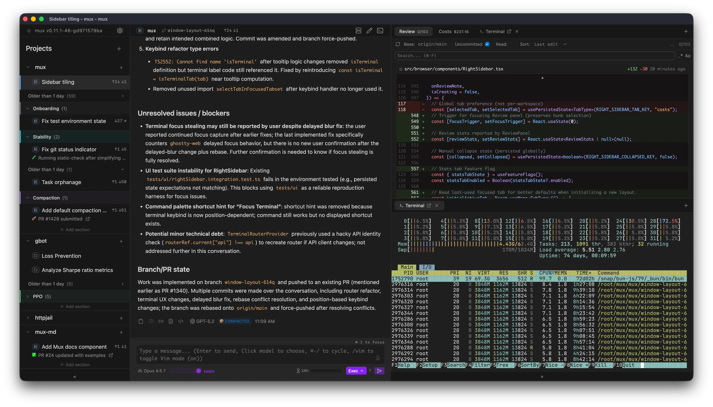

# mux - coding agent multiplexer

A desktop & browser application for parallel agentic development.

## Features

- **Isolated workspaces** with central view on git divergence ([docs](https://mux.coder.com/runtime))
  - **[Local](https://mux.coder.com/runtime/local)**: run directly in your project directory
  - **[Worktree](https://mux.coder.com/runtime/worktree)**: git worktrees on your local machine
  - **[SSH](https://mux.coder.com/runtime/ssh)**: remote execution on a server over SSH
- **Multi-model** (`sonnet-4-*`, `grok-*`, `gpt-5-*`, `opus-4-*`)
  - Ollama supported for local LLMs ([docs](https://mux.coder.com/config/models#ollama-local))
  - OpenRouter supported for long-tail of LLMs ([docs](https://mux.coder.com/config/models#openrouter-cloud))
- **VS Code Extension**: Jump into mux workspaces directly from VS Code ([docs](https://mux.coder.com/integrations/vscode-extension))
- Supporting UI and keybinds for efficiently managing a suite of agents
- Rich markdown outputs (mermaid diagrams, LaTeX, etc.)

mux has a custom agent loop but much of the core UX is inspired by Claude Code. You'll find familiar features like Plan/Exec mode, vim inputs, `/compact` and new ones
like [opportunistic compaction](https://mux.coder.com/workspaces/compaction) and [mode prompts](https://mux.coder.com/agents/instruction-files#mode-prompts).

**[Read the full documentation →](https://mux.coder.com)**

## Install

Download pre-built binaries from [the releases page](https://github.com/coder/mux/releases) for
macOS and Linux.

[More on installation →](https://mux.coder.com/install)

## Screenshots

  
<em>Integrated code-review for faster iteration:

  

  
<em>Agents report their status through the sidebar:</em>

  

  
<em>Git divergence UI keeps you looped in on changes and potential conflicts:</em>

  

  
<em>Mermaid diagrams make it easier to review complex proposals from the Agent:</em>

  

  
<em>Project secrets help split your Human and Agent identities:</em>

  

  
<em>Stay looped in on costs and token consumption:</em>

  

  
<em>Opportunistic compaction helps keep context small:</em>

  

## More reading

See [the documentation](https://mux.coder.com) for more details.

## Development

See [AGENTS.md](./AGENTS.md) for development setup and guidelines.

## License

Copyright (C) 2025 Coder Technologies, Inc.

This program is free software: you can redistribute it and/or modify it under the terms of the GNU Affero General Public License as published by the Free Software Foundation, version 3 of the License.

See [LICENSE](./LICENSE) for details.
