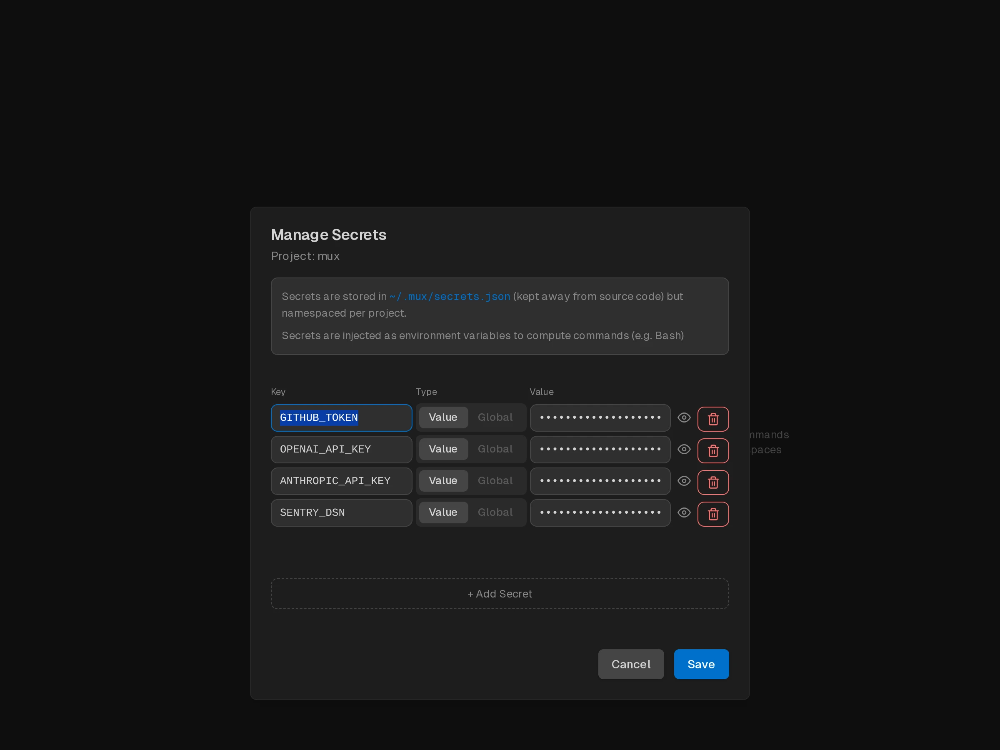

Securely manage environment variables for your projects in mux. Project secrets are automatically injected when the agent executes bash commands, making it easy to provide API keys, tokens, and other sensitive configuration.



## What Are Project Secrets?

Project secrets are key-value pairs stored per project that are:

- **Automatically injected** as environment variables when running bash commands
- **Stored outside repo** in `~/.mux/secrets.json`
- **Project-scoped** - each project has its own set of secrets
- **Workspace-inherited** - all workspaces in a project use the same secrets

## Common Use Cases

- **API Keys**: `ANTHROPIC_API_KEY`, `OPENAI_API_KEY`, `GITHUB_TOKEN`
- **Authentication tokens**: `NPM_TOKEN`, `DOCKER_HUB_TOKEN`
- **Database credentials**: `DATABASE_URL`, `POSTGRES_PASSWORD`
- **Service endpoints**: `API_BASE_URL`, `WEBHOOK_URL`
- **Build configuration**: `BUILD_ENV`, `FEATURE_FLAGS`

## Managing Secrets

### Opening the Secrets Modal

1. Find your project in the left sidebar
2. Hover over the project name
3. Click the 🔑 key icon that appears

## How Secrets Are Used

When the agent runs bash commands (via the `bash` tool), all project secrets are automatically injected as environment variables:

```bash
# If you have a secret: GH_TOKEN=ghp_abc123
# The agent can use it in commands:
gh api /user  # Uses GH_TOKEN from environment
```

The agent doesn't need to explicitly reference secrets - they're available as regular environment variables in all bash executions within that project's workspaces.

## Security Considerations

### Storage

- Secrets are stored in `~/.mux/config.json`
- **Stored in plaintext** - the config file is not encrypted
- The config file has standard user-only file permissions

## Related

- [Agentic Git Identity](/agentic-git-identity) - Configure Git credentials for AI commits using Project Secrets
